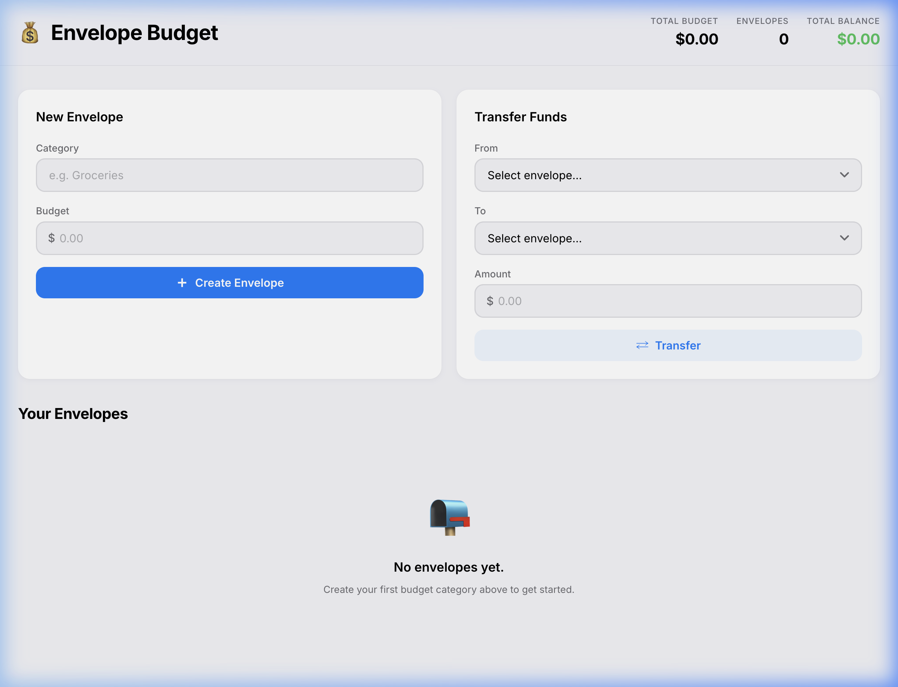
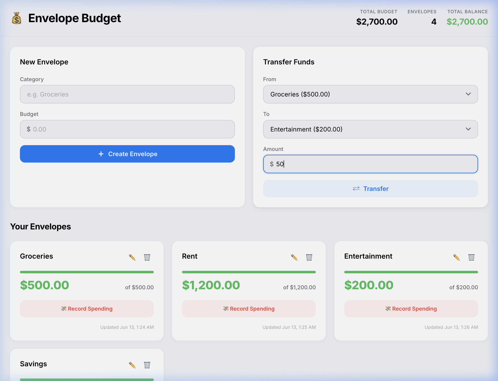

# 💰 Envelope Budget

> An enterprise-grade Envelope Budgeting application built with Node.js/Express and a native vanilla JavaScript frontend, styled after Apple's Human Interface Guidelines (HIG).


---

## Table of Contents

- [Overview](#overview)
- [Screenshots](#screenshots)
- [Architecture](#architecture)
- [Project Structure](#project-structure)
- [Getting Started](#getting-started)
- [API Reference](#api-reference)
- [Frontend Features](#frontend-features)
- [Design System](#design-system)
- [Technical Specifications](#technical-specifications)
- [License](#license)

---

## Overview

Envelope Budgeting is a personal finance method where you allocate your total income into virtual "envelopes" — each dedicated to a specific spending category (groceries, rent, entertainment, etc.). When an envelope runs out, you stop spending in that category.

This application provides:

- **RESTful API** for full CRUD operations on budget envelopes
- **Atomic fund transfers** between envelopes
- **Real-time spending tracking** with overdraft protection
- **Apple HIG-inspired UI** with dark/light mode, translucent headers, and micro-animations
- **In-memory storage** with auto-incrementing IDs and transactional guarantees

---

## Screenshots

### Dashboard — Envelope Cards

The main view showing all budget envelopes with health-indicator progress bars, real-time balance tracking, and quick-action buttons.


### Empty State

A clean onboarding experience when no envelopes have been created yet.



### Record Spending Modal

A focused modal overlay for recording expenses against a specific envelope, with available balance shown.


### Transfer Funds Form

The persistent transfer panel allows instant fund reallocation between any two envelopes.



---

## Architecture

```
┌──────────────────────────────────────────────────────────────────┐
│                        Browser Client                            │
│  ┌─────────┐  ┌─────────┐  ┌──────────┐                        │
│  │index.html│  │styles.css│  │  app.js  │                        │
│  └─────────┘  └─────────┘  └──────────┘                        │
│         │            │            │                               │
│         └────────────┴────────────┘                               │
│                      │  fetch()                                   │
└──────────────────────┼───────────────────────────────────────────┘
                       │ HTTP JSON
┌──────────────────────┼───────────────────────────────────────────┐
│                 Express Server                                    │
│  ┌──────────┐  ┌───────────────┐  ┌────────────────────┐        │
│  │ server.js │→ │envelopeRoutes │→ │envelopeController  │        │
│  │(middleware)│  │  (router)     │  │ (request handlers) │        │
│  └──────────┘  └───────────────┘  └────────┬───────────┘        │
│                                             │                     │
│                                    ┌────────▼───────────┐        │
│                                    │   budgetStore.js    │        │
│                                    │ (in-memory model)   │        │
│                                    └────────────────────┘        │
│                                                                   │
│  ┌──────────────┐                                                │
│  │constants.js  │ ← shared config, status codes, error messages  │
│  └──────────────┘                                                │
└──────────────────────────────────────────────────────────────────┘
```

**Key design decisions:**
- **Layered MVC** — Models, controllers, and routes are fully decoupled
- **Singleton store** — A single in-memory module maintains all state with transactional methods
- **Defensive validation** — Every input is validated at the controller layer before reaching the model
- **Atomic transfers** — Fund movements between envelopes happen as a single indivisible operation

---

## Project Structure

```
personal-budget-expressjs/
├── config/
│   └── constants.js          # Centralized config, status codes, error messages
├── models/
│   └── budgetStore.js        # In-memory storage singleton with CRUD + transfer
├── controllers/
│   └── envelopeController.js # Request/response handlers with schema validation
├── routes/
│   └── envelopeRoutes.js     # Express Router — decoupled route definitions
├── public/
│   ├── index.html            # Semantic HTML5 with modals and toast container
│   ├── styles.css            # Apple HIG design system (CSS custom properties)
│   └── app.js                # Vanilla JS client — API layer, rendering, events
├── screenshots/              # Application screenshots for documentation
├── server.js                 # Express entry point — middleware, static, routing
├── package.json              # Project manifest and dependencies
└── README.md                 # This file
```

---

## Getting Started

### Prerequisites

- **Node.js** ≥ 18.0 (uses `--watch` flag for dev mode)
- **npm** ≥ 8.0

### Installation

```bash
# Clone the repository
git clone <your-repo-url>
cd personal-budget-expressjs

# Install dependencies
npm install
```

### Running

```bash
# Development mode (auto-restart on file changes)
npm run dev

# Production mode
npm start
```

The server starts at **http://localhost:3000** by default.

### Environment Variables

| Variable | Default | Description |
|----------|---------|-------------|
| `PORT`   | `3000`  | Port the Express server listens on |

---

## API Reference

All API endpoints are mounted under `/envelopes`. Request and response bodies are JSON.

### Base URL

```
http://localhost:3000/envelopes
```

### Endpoints

#### `POST /envelopes` — Create Envelope

Create a new budget envelope. The initial balance equals the budget, and the total budget is incremented accordingly.

**Request Body:**
```json
{
  "title": "Groceries",
  "budget": 500
}
```

**Response:** `201 Created`
```json
{
  "data": {
    "id": 1,
    "title": "Groceries",
    "budget": 500,
    "balance": 500,
    "createdAt": "2026-06-12T20:24:14.474Z",
    "updatedAt": "2026-06-12T20:24:14.474Z"
  }
}
```

**Validation:**
- `title` — Required, non-empty string, max 128 characters
- `budget` — Required, non-negative number, max 1,000,000,000

---

#### `GET /envelopes` — List All Envelopes

Returns every envelope along with the global total budget.

**Response:** `200 OK`
```json
{
  "data": {
    "totalBudget": 2700,
    "envelopes": [
      { "id": 1, "title": "Groceries", "budget": 500, "balance": 500, "..." : "..." },
      { "id": 2, "title": "Rent", "budget": 1200, "balance": 1200, "..." : "..." }
    ]
  }
}
```

---

#### `GET /envelopes/:id` — Get Single Envelope

**Response:** `200 OK` or `404 Not Found`
```json
{
  "data": {
    "id": 1,
    "title": "Groceries",
    "budget": 500,
    "balance": 450,
    "createdAt": "2026-06-12T20:24:14.474Z",
    "updatedAt": "2026-06-12T20:30:00.000Z"
  }
}
```

---

#### `PUT /envelopes/:id` — Update Envelope

Mutate the title, budget, and/or balance of an existing envelope.

- **Budget changes** adjust the total budget by the delta and the balance proportionally
- **Balance must never drop below 0** — overdrafts return `400 Bad Request`

**Request Body** (all fields optional, at least one required):
```json
{
  "title": "Weekly Groceries",
  "budget": 600,
  "balance": 450
}
```

**Response:** `200 OK`, `400 Bad Request`, or `404 Not Found`

---

#### `DELETE /envelopes/:id` — Delete Envelope

Removes the envelope and decrements its remaining balance from the total budget.

**Response:** `204 No Content` or `404 Not Found`

---

#### `POST /envelopes/transfer/:fromId/:toId` — Transfer Funds

Atomically transfer funds from one envelope to another. Fails fast if funds are insufficient or either ID doesn't match.

**Request Body:**
```json
{
  "amount": 50
}
```

**Response:** `200 OK`
```json
{
  "data": {
    "from": { "id": 1, "title": "Groceries", "balance": 450, "..." : "..." },
    "to":   { "id": 3, "title": "Entertainment", "balance": 250, "..." : "..." }
  }
}
```

---

#### `GET /health` — Health Check

```json
{
  "status": "ok",
  "uptime": 765.96
}
```

---

### Error Response Format

All errors follow a uniform JSON structure:

```json
{
  "error": "Descriptive error message."
}
```

| Status Code | Usage |
|-------------|-------|
| `400` | Validation failure, overdraft, insufficient funds |
| `404` | Envelope not found |
| `409` | Conflict (reserved for future use) |
| `500` | Unexpected server error |

---

## Frontend Features

The client is a zero-dependency vanilla JavaScript SPA that communicates with the REST API via `fetch()`.

| Feature | Description |
|---------|-------------|
| **Create Envelopes** | Form with real-time validation and instant feedback |
| **Edit Envelopes** | Modal dialog to modify title and budget |
| **Delete Envelopes** | Confirmation dialog + exit animation |
| **Record Spending** | Dedicated modal showing available balance |
| **Transfer Funds** | Dropdown-based form for instant reallocation |
| **Progress Bars** | Color-coded health indicators (green → orange → red) |
| **Toast Notifications** | Success/error/info toasts with auto-dismiss |
| **Keyboard Navigation** | Escape key closes modals |
| **XSS Protection** | All user content is HTML-escaped before rendering |
| **Dark/Light Mode** | Automatic via `prefers-color-scheme` media query |

---

## Design System

The UI follows Apple's Human Interface Guidelines with these tokens:

### Colors

| Token | Light | Dark | Usage |
|-------|-------|------|-------|
| Canvas | `#F2F2F7` | `#000000` | Page background |
| Surface | `#FFFFFF` | `#1C1C1E` | Cards and panels |
| System Blue | `#007AFF` | `#007AFF` | Primary actions, links |
| System Green | `#34C759` | `#34C759` | Positive balances, success |
| System Red | `#FF3B30` | `#FF3B30` | Overdraft warnings, danger |
| System Orange | `#FF9500` | `#FF9500` | Low-balance warnings |

### Typography

- **Font Stack:** Inter → -apple-system → BlinkMacSystemFont → SF Pro
- **Scale:** 11px (xs) → 34px (xxl)
- **Weights:** 400 (regular) through 800 (heavy)

### Spacing

All spacing uses 4px base increments: 4, 8, 12, 16, 20, 24, 32, 40px

### Animations

- **Card enter:** `translateY(16px) scale(0.97) → origin` with spring easing
- **Card exit:** `opacity → 0, scale(0.92)` on delete
- **Modal:** backdrop-filter blur + scale spring transition
- **Buttons:** `scale(0.97)` on press, `scale(1.1)` hover on icon buttons
- **Toasts:** slide-up entry with spring easing, slide-up exit

---

## Technical Specifications

### BudgetStore (`models/budgetStore.js`)

- **Singleton pattern** — single module-scoped state
- **Auto-incrementing IDs** — `nextId` counter ensures uniqueness
- **Floating-point safety** — `Math.round((n + EPSILON) * 100) / 100` on every mutation
- **Atomic transfers** — both debit and credit happen synchronously in a single function call
- **Defensive copies** — all reads return shallow clones via spread operator

### EnvelopeController (`controllers/envelopeController.js`)

- **Rigid schema validation** before every store operation
- **Uniform response format** — `{ data }` on success, `{ error }` on failure
- **Semantic HTTP status codes** — 200, 201, 204, 400, 404
- **ID parsing helper** — validates positive integers, rejects NaN/negative/zero

### Server (`server.js`)

- **Middleware:** `express.json()` for body parsing
- **Static serving:** `express.static()` from `/public`
- **404 catch-all** for unmatched routes
- **Global error handler** with stack trace logging

---

## License

This project is licensed under the MIT License.
