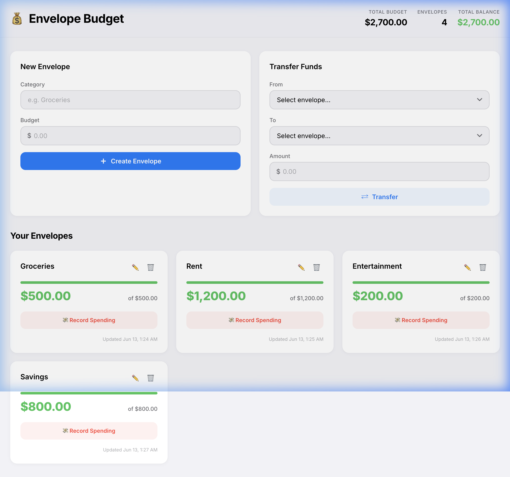

# Envelope Budget API

> A production-oriented envelope budgeting application built with **Node.js**, **Express**, **PostgreSQL**, and **Sequelize ORM**, paired with a vanilla JavaScript frontend styled after Apple's Human Interface Guidelines (HIG).

[](https://nodejs.org/)
[](https://www.postgresql.org/)
[](https://expressjs.com/)
[](LICENSE)

**Repository:** [github.com/Mahnoor-Zaffar/Envelope-Budget-API](https://github.com/Mahnoor-Zaffar/Envelope-Budget-API)

---

## Table of Contents

- [Overview](#overview)
- [Project Status](#project-status)
- [Tech Stack](#tech-stack)
- [Architecture](#architecture)
- [Data Model](#data-model)
- [Project Structure](#project-structure)
- [Getting Started](#getting-started)
- [API Reference](#api-reference)
- [Interactive Documentation](#interactive-documentation)
- [Frontend](#frontend)
- [Deployment](#deployment)
- [Design System](#design-system)
- [Related Documentation](#related-documentation)
- [License](#license)

---

## Overview

Envelope budgeting allocates income into category-specific **envelopes** (groceries, rent, entertainment, etc.). Each envelope tracks an allocated **budget** and a spendable **balance**. When an envelope is depleted, spending in that category stops until funds are reallocated or new income is logged.

This project evolved from an in-memory Express prototype (Part I) into a **persistent, database-backed API** (Part II) with:

- Full **envelope CRUD** and **atomic fund transfers**
- A dedicated **transaction subsystem** that logs external expenditures and adjusts envelope balances
- **Swagger UI** for interactive API exploration
- **Render-ready** deployment configuration



---

## Project Status

| Phase | Scope | Status |
|-------|-------|--------|
| **Phase 1** | Local PostgreSQL setup, `.env` configuration, database creation | ✅ Complete |
| **Phase 2** | Sequelize models, envelope + transaction API, Swagger integration | ✅ Complete |
| **Phase 3** | Local verification (health check, Swagger, curl/API testing) | ✅ Complete |
| **Phase 4** | Frontend migration to `/transactions` API | ✅ Complete |
| **Phase 5** | Production deployment on Render | ⏳ Pending |

See [`todo.md`](todo.md) for the live task board.

---

## Tech Stack

| Layer | Technology |
|-------|------------|
| Runtime | Node.js ≥ 18 |
| Web framework | Express 4 |
| Database | PostgreSQL |
| ORM | Sequelize 6 |
| API docs | Swagger UI (`swagger-ui-express`) |
| Security | Helmet, CORS, in-memory rate limiting |
| Frontend | Vanilla HTML / CSS / JavaScript (zero build step) |
| Deployment target | Render (Web Service + Managed PostgreSQL) |

---

## Architecture

```
┌─────────────────────────────────────────────────────────────────────┐
│                         Browser Client                              │
│              public/index.html · styles.css · app.js                │
│                              │ fetch()                              │
└──────────────────────────────┼──────────────────────────────────────┘
                               │ HTTP / JSON
┌──────────────────────────────┼──────────────────────────────────────┐
│                        Express Server                               │
│  ┌──────────┐   ┌─────────────────────────────────────────────┐    │
│  │ server.js│──►│ Middleware: Helmet · CORS · Rate Limit · JSON│    │
│  └──────────┘   └─────────────────────────────────────────────┘    │
│         │                                                             │
│         ├── /api-docs ──────► Swagger UI (docs/swagger.json)         │
│         ├── /health ────────► Health check                           │
│         ├── /envelopes ─────► envelopeRoutes → envelopeController    │
│         └── /transactions ──► transactionRoutes → transactionController│
│                                          │                            │
│                              ┌───────────▼───────────┐               │
│                              │   Sequelize ORM        │               │
│                              │  Envelope · Transaction│               │
│                              └───────────┬───────────┘               │
└──────────────────────────────────────────┼───────────────────────────┘
                                           │ SQL (pooled connection)
                              ┌────────────▼────────────┐
                              │      PostgreSQL         │
                              │  envelopes · transactions│
                              └─────────────────────────┘
```

### Design principles

- **Layered MVC** — routes, controllers, and models are decoupled; controllers own validation, models own persistence.
- **Database transactions** — fund transfers and transaction writes use `sequelize.transaction()` with row-level locks to preserve atomicity.
- **Defensive validation** — every request is validated at the controller layer before hitting the database.
- **Uniform API contract** — `{ data: ... }` on success, `{ error: "..." }` on failure.
- **Environment-driven config** — connection strings and pool settings resolve from environment variables; SSL is enabled automatically in production.

---

## Data Model

```
[ Envelope ] 1 ──── * [ Transaction ]
```

### Envelope

| Column | Type | Constraints |
|--------|------|-------------|
| `id` | Integer | Primary key, auto-increment |
| `title` | String(128) | Required, unique |
| `budget` | Decimal(12,2) | Required, ≥ 0 |
| `balance` | Decimal(12,2) | Required, ≥ 0 |

### Transaction

| Column | Type | Constraints |
|--------|------|-------------|
| `id` | Integer | Primary key, auto-increment |
| `date` | Timestamp | Required |
| `amount` | Decimal(12,2) | Required, > 0 |
| `recipient` | String(256) | Required |
| `envelopeId` | Integer | Foreign key → `envelopes.id` (CASCADE on delete) |

**Domain rules:**
- Creating a transaction **deducts** `amount` from the linked envelope's balance.
- Deleting a transaction **refunds** `amount` back to the envelope.
- Updating a transaction recalculates balances safely when `amount` or `envelopeId` changes.
- Envelope balances cannot drop below zero.

---

## Project Structure

```
personal-budget-expressjs/
├── config/
│   ├── constants.js          # Ports, paths, status codes, error messages
│   └── database.js           # Sequelize connection pool + SSL config
├── controllers/
│   ├── envelopeController.js # Envelope CRUD + transfer handlers
│   └── transactionController.js
├── models/
│   ├── index.js              # Associations + initDatabase()
│   ├── envelope.js
│   └── transaction.js
├── routes/
│   ├── envelopeRoutes.js
│   └── transactionRoutes.js
├── utils/
│   └── controllerHelpers.js  # Parsing, formatting, error mapping
├── docs/
│   └── swagger.json          # OpenAPI 3.0 specification
├── public/                   # Vanilla frontend (Phase 4 migration in progress)
├── server.js                 # Express entry point
├── .env.example              # Environment variable template
├── render.yaml               # Render Blueprint (IaC)
├── DEPLOYMENT.md             # Production deployment guide
├── PRD.md                    # Product requirements (Part II)
├── todo.md                   # Kanban task board
└── README.md
```

---

## Getting Started

### Prerequisites

- **Node.js** ≥ 18
- **npm** ≥ 8
- **PostgreSQL** ≥ 14 (local install or Docker)

### 1. Clone and install

```bash
git clone https://github.com/Mahnoor-Zaffar/Envelope-Budget-API.git
cd Envelope-Budget-API
npm install
```

### 2. Configure environment

```bash
cp .env.example .env
```

Edit `.env` with your local PostgreSQL credentials:

```env
PORT=3000
NODE_ENV=development
DATABASE_URL=postgresql://YOUR_USER@localhost:5432/envelope_budget
```

> `.env` is gitignored and never committed. Only `.env.example` is tracked.

### 3. Create the database

```bash
createdb envelope_budget
# or: psql postgres -c "CREATE DATABASE envelope_budget;"
```

Ensure PostgreSQL is running:

```bash
pg_isready
```

### 4. Start the server

```bash
# Development (auto-restart on file changes)
npm run dev

# Production
npm start
```

On successful startup:

```
✓  PostgreSQL connected and models synchronized.
✦  Envelope Budget API listening on http://localhost:3000
   Envelopes:    /envelopes
   Transactions: /transactions
   Swagger:      /api-docs
   Health:       /health
```

### Environment variables

| Variable | Default | Description |
|----------|---------|-------------|
| `PORT` | `3000` | HTTP port |
| `NODE_ENV` | `development` | Set to `production` on Render (enables DB SSL) |
| `DATABASE_URL` | — | **Required.** PostgreSQL connection string |
| `DB_POOL_MAX` | `5` | Max connections in pool |
| `DB_POOL_MIN` | `0` | Min idle connections |
| `DB_LOGGING` | `false` | Set to `true` to log SQL queries |

---

## API Reference

All endpoints accept and return **JSON**. Base URLs:

| Resource | Base path |
|----------|-----------|
| Envelopes | `/envelopes` |
| Transactions | `/transactions` |
| Health | `/health` |
| Docs | `/api-docs` |

### Envelopes

| Method | Endpoint | Description |
|--------|----------|-------------|
| `POST` | `/envelopes` | Create envelope (`title`, `budget`) |
| `GET` | `/envelopes` | List all envelopes + aggregated `totalBudget` |
| `GET` | `/envelopes/:id` | Get envelope by ID |
| `PUT` | `/envelopes/:id` | Update `title`, `budget`, and/or `balance` |
| `DELETE` | `/envelopes/:id` | Delete envelope (cascades transactions) |
| `POST` | `/envelopes/transfer/:fromId/:toId` | Atomic fund transfer (`amount`) |

**Create envelope example:**

```bash
curl -X POST http://localhost:3000/envelopes \
  -H "Content-Type: application/json" \
  -d '{"title":"Groceries","budget":500}'
```

**Transfer example:**

```bash
curl -X POST http://localhost:3000/envelopes/transfer/1/2 \
  -H "Content-Type: application/json" \
  -d '{"amount":50}'
```

### Transactions

| Method | Endpoint | Description |
|--------|----------|-------------|
| `POST` | `/transactions` | Log expenditure; deducts from envelope balance |
| `GET` | `/transactions` | List all transactions |
| `GET` | `/transactions/:id` | Get transaction by ID |
| `PUT` | `/transactions/:id` | Update transaction; recalculates balances |
| `DELETE` | `/transactions/:id` | Delete transaction; refunds envelope balance |

**Create transaction example:**

```bash
curl -X POST http://localhost:3000/transactions \
  -H "Content-Type: application/json" \
  -d '{
    "date": "2026-06-25T12:00:00.000Z",
    "amount": 42.50,
    "recipient": "Whole Foods",
    "envelopeId": 1
  }'
```

### Error responses

```json
{ "error": "Descriptive error message." }
```

| Status | Meaning |
|--------|---------|
| `400` | Validation failure, insufficient funds, overdraft |
| `404` | Envelope or transaction not found |
| `429` | Rate limit exceeded |
| `500` | Unexpected server error |

---

## Interactive Documentation

Full OpenAPI 3.0 specs with request/response schemas are served at:

**http://localhost:3000/api-docs**

Use Swagger UI to explore all endpoints, payload shapes, and status code variations without leaving the browser.

---

## Frontend

The client lives in `public/` and is served as static assets by Express. It provides:

- Envelope cards with health-indicator progress bars
- Create, edit, delete, transfer, and spend flows
- Dark/light mode, toast notifications, modal dialogs
- Apple HIG-inspired design tokens

### Phase 4 — API alignment (complete)

The frontend uses the Part II transaction API:

| Feature | Endpoint |
|---------|----------|
| Record spending | `POST /transactions` |
| View history | `GET /transactions` (filtered by `envelopeId`) |
| Envelope CRUD + transfer | `/envelopes` (unchanged) |

The distribute-income panel was removed — that endpoint is not part of Part II. Income can be added manually via envelope budget updates until a distribute endpoint is re-implemented.

---

## Deployment

Production deployment targets **Render** with a managed PostgreSQL instance.

- **Quick start:** use the included [`render.yaml`](render.yaml) Blueprint
- **Step-by-step guide:** see [`DEPLOYMENT.md`](DEPLOYMENT.md)

Render injects `DATABASE_URL` automatically when the database is linked to the web service. Set `NODE_ENV=production` to enable SSL for database connections.

---

## Design System

The UI follows Apple's Human Interface Guidelines. Full visual specs are in [`design.md`](design.md).

| Token | Light | Dark | Usage |
|-------|-------|------|-------|
| Canvas | `#F2F2F7` | `#000000` | Page background |
| Surface | `#FFFFFF` | `#1C1C1E` | Cards and panels |
| System Blue | `#007AFF` | `#007AFF` | Primary actions |
| System Green | `#34C759` | `#34C759` | Positive balances |
| System Red | `#FF3B30` | `#FF3B30` | Warnings, danger |

Typography uses Inter → SF Pro system stack. Spacing follows a 4px grid. Motion uses spring easing on cards, modals, and toasts.

---

## Related Documentation

| Document | Purpose |
|----------|---------|
| [`PRD.md`](PRD.md) | Product requirements — Part II scope and acceptance criteria |
| [`todo.md`](todo.md) | Kanban board — current task status |
| [`DEPLOYMENT.md`](DEPLOYMENT.md) | Render deployment instructions |
| [`docs/swagger.json`](docs/swagger.json) | OpenAPI 3.0 specification |
| [`design.md`](design.md) | HIG design system reference |

---

## License

This project is licensed under the MIT License.
